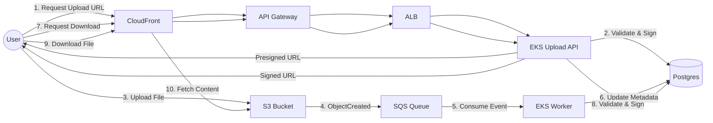

# System Design Document

## 1. Overview

### 1.1 Problem Statement

Design and build a file storage and delivery platform on AWS that:

- Allows users to upload files up to 50 MB each
- Enforces a per-user storage quota of 1 GB (configurable)
- Provides fast, CDN-backed download of stored files
- Is horizontally scalable, observable, and resilient to failures

The system should showcase strong DevOps and system design principles: infrastructure as code, container orchestration, decoupled services, and observability.

## 2. Requirements

### 2.1 Functional Requirements

#### User uploads

- Users can upload files up to 50 MB.
- Each user has a total storage quota of 1 GB (soft limit for now).
- Files are stored in an S3 bucket.

#### File access

- Users can list files they have uploaded.
- Users can download their own files via a CDN endpoint.
- Optional: some files can be marked as publicly shareable via URL.

#### Metadata & quotas

- System stores metadata for each file: `file_id`, `user_id`, `filename`, `size`, `checksum`, `storage_path`, `timestamps`, `visibility`.
- System enforces per-user quota when generating upload URLs.

#### Admin capabilities (MVP-light)

- View total storage usage.
- View per-user usage.
- (Future) Soft-delete or hard-delete files.

### 2.2 Non-Functional Requirements

#### Scalability

- Support tens of thousands of users and millions of files over time.
- Upload and download paths scale independently.

#### Availability

- Target 99.9% uptime for upload and download APIs.
- No single-region multi-region complexity in v1, but design should support it later.

#### Performance

- Upload URL generation p95 < 200 ms.
- Download latency dominated by CloudFront edge, not origin.

#### Security

- Files are private by default.
- Access is controlled via signed URLs and user authorisation in the API.
- S3 bucket is not public; only CloudFront origin access is allowed.

#### Cost

- Leverage S3 + CloudFront for cost-effective storage and delivery.
- Allow scaling down EKS worker capacity when idle.

#### Operability

- Full observability: logs, metrics, traces.
- Infrastructure managed via IaC (Terraform).
- Automated deployments through CI/CD.

## 3. High-Level Architecture

### Data Flow Summary



#### Upload flow

1. User → CloudFront (Web App) → API Gateway → ALB (Ingress) → EKS Upload API
2. Upload API validates user & quota → generates S3 presigned upload URL → returns to client.
3. Client uploads directly to S3 using the presigned URL.
4. S3 emits Object Created event → SQS queue.
5. EKS Process Events worker consumes SQS messages, fetches S3 object metadata, updates Postgres (file record, user usage).

#### Download flow

1. User requests file via Web App → API → authorisation & ownership check → API generates CloudFront signed URL (or S3 presigned URL) → user downloads via CloudFront.

#### Observability

- EKS pods emit logs/metrics/traces via AWS Distro for OpenTelemetry → CloudWatch (and, potentially, external APM).
- CloudFront / API Gateway logs go to CloudWatch / S3 for analytics.

## 4. Components

### 4.1 AWS CloudFront (Web App + File CDN)

Single CloudFront distribution with two URL behaviours:

- `/app/*` → Web UI (static assets from S3 or another origin)
- `/files/*` → File download path (S3 origin)

- Uses Origin Access Control (OAC) so S3 bucket is private.
- Optionally uses signed URLs for per-file, time-bound access.

### 4.2 Amazon API Gateway

Public HTTP API endpoint.

- Handles:
  - Authentication/authorisation (JWT, Cognito, or custom).
  - Routing to EKS via ALB.
  - Request throttling / rate limiting.
- Integrates with CloudWatch Logs for API-level metrics and tracing.

### 4.3 AWS Load Balancer Controller (Ingress for EKS)

- Manages an Application Load Balancer (ALB) as Kubernetes Ingress.
- Routes API Gateway traffic to services in EKS based on path/host rules.
- Handles TLS termination if not done in API Gateway.

### 4.4 Amazon EKS Cluster

#### Upload API Deployment

Stateless REST API.

- Responsibilities:
  - Authenticate users.
  - Expose endpoints:
    - `POST /files/presign-upload`
    - `GET /files`
    - `GET /files/{id}/download-url`
  - Validate quota using Postgres.
  - Generate S3 presigned upload URLs.
  - Generate CloudFront signed URLs for download.

#### Process Events Deployment (Worker)

Consumer of SQS queue.

- Responsibilities:
  - Poll SQS messages for S3 ObjectCreated events.
  - Fetch object metadata from S3 (size, key, checksum if needed).
  - Insert/update file metadata in Postgres.
  - Update user storage usage.
  - Apply any business rules (e.g. virus scanning hook, file type validation).

### 4.5 S3 Bucket (Origin for CDN + Upload Storage)

- Stores all uploaded files.
- Private; only accessible to:
  - Upload clients via presigned URLs.
  - CloudFront via OAC.
  - Worker/API via IAM roles.
- Key structure example: `user/{user_id}/{file_id}`

### 4.6 Amazon SQS

- Queue receiving S3 events.
- Decouples S3 event emission from processing logic.
- Ensures reliable, retriable processing even if workers are down or overloaded.
- DLQ configured for poison messages or repeated failures.

### 4.7 PostgreSQL (ideally RDS PostgreSQL)

Stores metadata and account state.

- Main tables:
  - `users`
  - `files`
  - `user_usage` or aggregated usage view
  - `audit_log` (optional)

### 4.8 Observability Stack

- **AWS Distro for OpenTelemetry**: Collects application traces, metrics, and logs from EKS pods.
- **Amazon CloudWatch**: Central location for:
  - Logs (application, API Gateway, ALB, CloudFront)
  - Metrics (CPU/mem for pods, API latency, queue depth)
  - Alarms (error rate, latency, queue backlog).

## 5. API Design (MVP)

Assume user is already authenticated (e.g. JWT in Authorization header).

### `POST /files/presign-upload`

**Body**:

```json
{
  "filename": "string",
  "size_bytes": "number",
  "content_type": "string"
}
```

**Flow**:

1. API verifies user quota (`current_usage + size_bytes <= limit`).
2. API generates S3 presigned PUT URL for key `user/{user_id}/{uuid}`.
3. Returns URL and file ID.

**Response**:

```json
{
  "file_id": "uuid",
  "upload_url": "https://s3-...",
  "expires_in": 900
}
```

#### `GET /files`

Returns paginated list of files owned by the user.

#### `GET /files/{id}/download-url`

1. Validates `user_id` owns `file_id`.
2. Generates CloudFront signed URL (or S3 presigned GET URL).

**Returns**:

```json
{
  "download_url": "https://cdn.example.com/files/...",
  "expires_in": 300
}
```

## 6. Data Model

### users

- `id` (UUID / bigint)
- `email`
- `created_at`
- `status`

### files

- `id` (UUID)
- `user_id`
- `s3_key` (e.g. `user/{user_id}/{uuid}`)
- `filename`
- `size_bytes`
- `content_type`
- `checksum` (optional)
- `visibility` (private, public_link, team etc.)
- `created_at`
- `processed_at`
- `status` (pending, processed, failed)

### user_usage

- `user_id`
- `total_bytes_used`
- `updated_at`

> You can either maintain `user_usage` explicitly or compute it via aggregate queries; explicit is better for fast quota checks.

## 7. Core Flows

### 7.1 Upload Flow

1. User accesses web app via CloudFront.
2. User selects file; frontend calls `POST /files/presign-upload`.
3. **Upload API**:
    - Authenticates user.
    - Checks `user_usage.total_bytes_used + file.size <= quota`.
    - Generates S3 presigned PUT URL.
4. Frontend uploads directly to S3 using the presigned URL.
5. S3 emits `ObjectCreated` event → SQS.
6. **Worker pod** consumes SQS message:
    - Reads S3 key and bucket.
    - Fetches object metadata.
    - Inserts file record into `files`.
    - Increments `user_usage.total_bytes_used`.
    - Metrics/logs sent to Observability Stack.

### 7.2 Download Flow

1. User opens file list (from `GET /files`).
2. User clicks “Download”.
3. Frontend calls `GET /files/{id}/download-url`.
4. **API**:
    - Validates ownership/visibility.
    - Generates CloudFront signed URL (path anchored on S3 origin key).
5. User’s browser downloads file from CloudFront edge.

## 8. Scaling & Performance

### 8.1 Horizontal Scaling

- **EKS Upload API**:
  - HPA based on CPU, RPS, or latency.
  - Stateless, multiple replicas.
- **EKS Worker**:
  - HPA based on SQS queue depth and processing latency.
  - More backlog → more workers.
- **S3 & CloudFront**: Managed services, scale automatically.
- **Postgres (RDS)**:
  - Vertical scaling for CPU/RAM.
  - Read replicas if reads grow.
  - Proper indexing on `user_id`, `file_id`.

### 8.2 Bottlenecks

- **DB writes for files + user_usage under heavy load.**
  - *Mitigation*: batched updates, partitioning, caching for quota checks.
- **SQS backlog during spikes.**
  - *Mitigation*: scale worker deployments via HPA.
- **CloudFront cache misses.**
  - *Mitigation*: appropriate caching policies & TTL.

## 9. Reliability & Failure Modes

### S3 temporarily unavailable

- Upload fails; handled client-side via retry with backoff.
- No SQS event, no DB entry; safe failure.

### Worker crashes while processing SQS

- Message becomes visible again after visibility timeout.
- After N attempts, message goes to DLQ.
- Alarms raised on DLQ growth.

### Postgres unavailable

- Worker fails to write metadata → retried.
- Upload already in S3; eventually consistent when DB recovers.
- API may deny new uploads if it cannot read quota; fail closed.

### SQS backlog grows

- HPA scales workers based on queue depth.
- CloudWatch alarm when queue age/size exceeds threshold.

### API pods unhealthy

- ALB health checks fail; traffic shifted to healthy pods.
- HPA can increase replica count if load high.

## 10. Security

### IAM Roles for Service Accounts (IRSA)

- EKS pods have fine-grained IAM roles for S3, SQS, RDS.

### S3 bucket policy

- Deny public access.
- Allow only:
  - Presigned requests.
  - CloudFront origin role.
  - Worker/API IAM roles.

### CloudFront signed URLs

- Short TTL.
- Prevent users from sharing long-lived public links.

### Transport security

- HTTPS everywhere: CloudFront, API Gateway, ALB.

### AuthN/AuthZ

- JWT from Cognito or custom IdP.
- API checks `user_id` in token vs file ownership.

### Audit logging

- Optional: store download/upload events in `audit_log`.

## 11. Observability & Operations

### Metrics (CloudWatch + OTel)

- API latency & error rate.
- SQS queue depth, age.
- Worker processing rate & failure rate.
- RDS CPU, connections, slow queries.
- S3/CloudFront request counts, 4xx/5xx.

### Logs

- Structured JSON logs from Upload API and Worker.
- API Gateway & ALB logs.
- CloudFront access logs (to S3 or CloudWatch).

### Tracing

- OTel traces through API → EKS pods → DB.
- Correlation IDs passed through requests, logs, and traces.

### Alarming

- High error rate (5xx) on API.
- SQS backlog > threshold.
- DLQ not empty.
- RDS storage > threshold.
- CloudFront 5xx spikes.

## 12. Trade-offs & Future Enhancements

### Trade-offs made

- **Single region**: Simpler, good for v1. Latency may be higher for distant users, but mitigated by CloudFront.
- **Relational DB**: Easier to enforce quotas and joins. Could become a bottleneck at massive scale; sharding or DynamoDB could be considered later.
- **S3 + Events + SQS**: Eventual consistency between S3 and DB. Slight delay between upload completion and metadata availability.

### Future enhancements

- Add virus scanning in the worker path (e.g. ClamAV).
- Add soft delete with lifecycle policies to move deleted objects to cheaper storage.
- Implement multi-tenant support with organisations/teams.
- Add multi-region active-passive with S3 replication and DNS failover.
- Add rate limiting per user on upload API.
